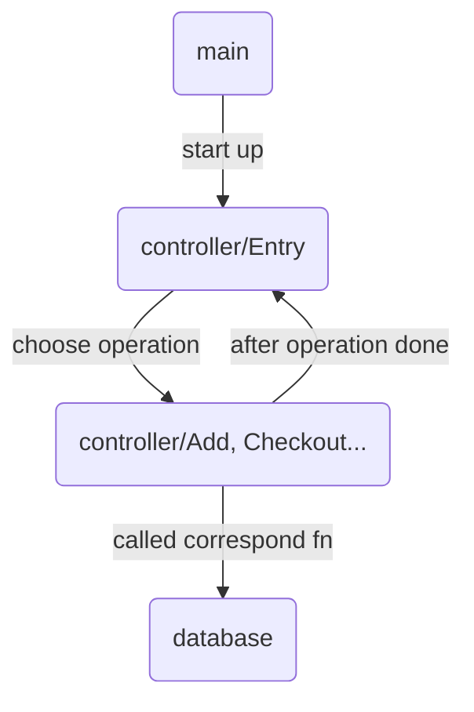

## Analyze

- Data Structure: Binary Search Tree (key: title)
- Search complexity analyze:  
  > By title: `O((N-K)+log(K))` where `logK` is the depth of first matched title  
  > By other criteria: `O(N)`
- Save data: using in order traversal to save data as sorted order
- Load data: using recursion to insert sorted data to ensure the balance of BST
- Validator:
  > string length should less or equal than 20  
  > non-integer input for integer would be blocked
## Main Logic

## Get started

#### Linux:
> compile: `g++ *.cpp object/*.cpp -o LMS`  
> run: `./LMS` 
#### Windows:
> complie: `g++ *cpp object/*.cpp -o LMS.exe`  
> run : `./LMS.exe`  
## Note

- The data would be saved in `pwd/data.txt`
- BST would be balanced after Save & Load (restart the system)
